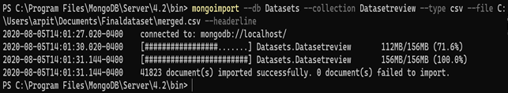
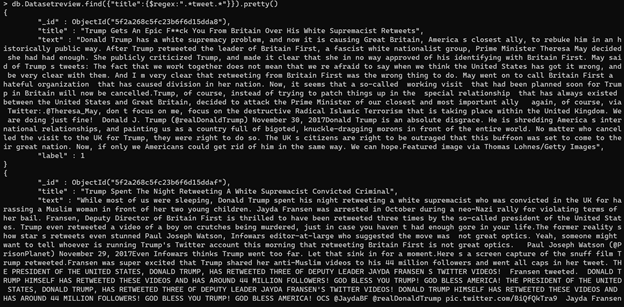

# Importing data into MongoDB

* Script main.py is ran to create the dataset consisting of news records from multiple datasets to train various ML models.   
* All the labelled and preprocessed records are exported in the merged.csv. 
* The following command imports the records in the NoSQL database. Here, we have configured MongoDB as our NoSQL database.
```
mongoimport --db Datasets --collection Datasetreview --type csv --file <filepath> --headerline
```
  

* To display the databases, use the following command:
```
show dbs
```
  
* Switch to the Datasets 
```
use Datasets
```
* To see the collections, run the following command
```
show collections
```
* Verify that the data is imported correctly by displaying the top first record
```
db.Datasetreview.findOne()
```
  
* Format the records to have a user-friendly view
```
db.Datasetreview.find({label:1}).pretty()
```
  
* To filter all the records containing "tweet" keyword:
```
db.Datasetreview.find({"title":{$regex:".*tweet.*}}).pretty()
```
  
